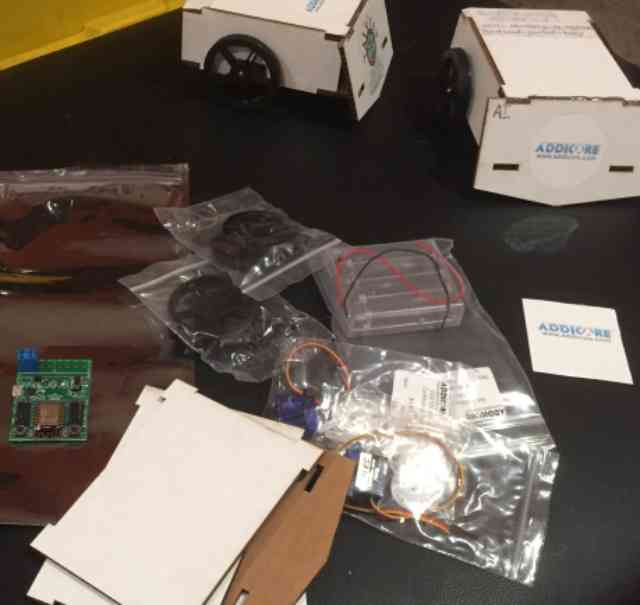
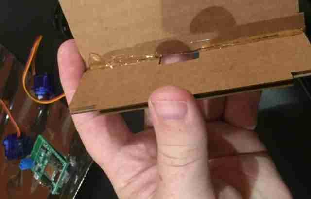
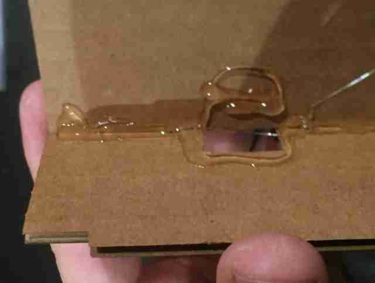
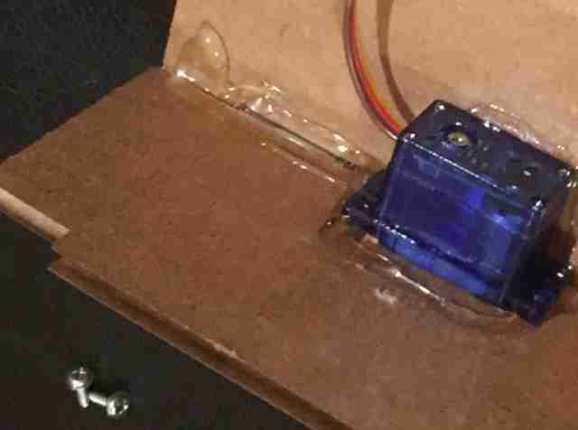
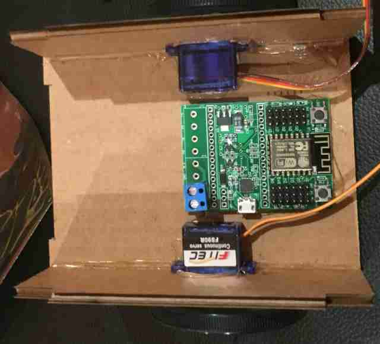
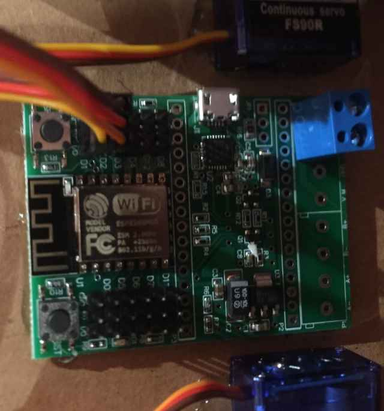
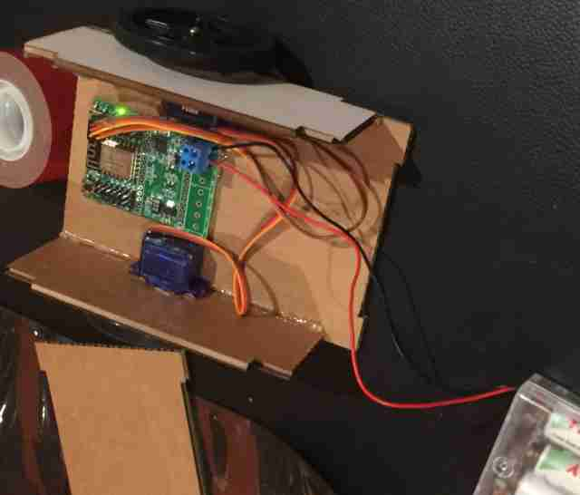

# BattleBot-Control SERVO#
This software is a simple, low-cost control system for the cardboard BattleBot community project. The project must support all 
skill levels, from young students to advanced adult makers. Therefore, the chosen platform and technologies are common and 
well-documented: Arduino, HTML5 and javascript. The hope is to leverage common maker skills or build them in inexperienced participants.

*Note: This is the old reliable tank control version, updated to use continuous rotation servos, with Addicore parts and directions that match those used at the Comic-Con Museum during San Diego Maker Faire 2018.*

#### Platform specifications: ####

 1. Arduino core libraries for the [ESP8266](http://esp8266.github.io/Arduino/versions/2.3.0/doc/libraries.html#mdns-and-dns-sd-responder-esp8266mdns-library). 
 2. Control over WiFi from a mobile device or computer via a browser-based user interface.
 3. Cardboard robot body, ranging from a simple box, to a laser cut design from CAD. And using these parts from our local friendly supplier, <a href="http://www.addicore.com">Addicore</a>:
<table width="497">
<tbody>
<tr>
<td width="65" data-sheets-value="{&quot;1&quot;:2,&quot;2&quot;:&quot;Part #&quot;}">Part #</td>
<td width="237" data-sheets-value="{&quot;1&quot;:2,&quot;2&quot;:&quot;Component&quot;}">Component</td>
<td width="65" data-sheets-value="{&quot;1&quot;:2,&quot;2&quot;:&quot;Qty&quot;}">Qty</td>
<td width="65" data-sheets-value="{&quot;1&quot;:2,&quot;2&quot;:&quot;Price&quot;}">Price</td>
<td width="65" data-sheets-value="{&quot;1&quot;:2,&quot;2&quot;:&quot;Price&quot;}">Amount</td>
</tr>
<tr>
<td><a href="https://www.addicore.com/SearchResults.asp?Search=AD313">AD313</a></td>
<td>AA 4-Battery Case with Power Switch</td>
<td>1</td>
<td>$2.00</td>
<td>$2.00</td>
</tr>
<tr>
<td><a href="https://www.addicore.com/Boffintronics-RoboBoffin-Mini-p/ad495.htm">AD495</a></td>
<td>ESP8266 based Addicore Boffintronics-RoboBoffin-Mini. 
 If you buy the <a href="https://www.addicore.com/Cardboard-Sumo-Bot-AddiKit-p/ad494.htm">cardboard combat kit</a> from Addicore, the board will come pre-loaded and you get the cardboard pre-cut. If you really like to solder, you can use a cheaper <a href="https://www.google.com/search?q=nodemcu">NodeMCU</a> and <a href="https://jamesnewton.github.io/class/presentESP8266servo.html#4">build a servo header (not easy!)</a></td>
<td>1</td>
<td>$12.50</td>
<td>$12.50</td>
</tr>
<tr>
<td><a href="https://www.addicore.com/SearchResults.asp?Search=AD314">AD314</a></td>
<td>FEETECH (Fitec) FS90R Continuous Rotation Servo (9g)</td>
<td>2</td>
<td>$4.84</td>
<td>$9.68</td>
</tr>
<tr>
<td><a href="https://www.addicore.com/SearchResults.asp?Search=AD315">AD315</a></td>
<td>Wheel for FS90R Servo (60x8mm)</td>
<td>2</td>
<td>$2.35</td>
<td>$4.70</td>
</tr>
</tbody>
</table>
You will need 4 AA batteries preferably rechargeable. The code changes to support continuous rotation servos are available here:
<a href="https://github.com/JamesNewton/BattleBot-Control/tree/patch-2">https://github.com/JamesNewton/BattleBot-Control/tree/patch-2</a>

The goal is to keep the cost of a base "kit" to under 35USD.

 #### Reference CAD: ####
 To aid in ideation and your designs, reference CAD files are provided for standard Kit of Parts hardware and a handful of reference designs: (designs for the DC motor version are found on the original branch)
 
  * The SUMO bot shape is simple enough that the files were just drawn in the laser cutter software. At some point, we should probably re-create them in CAD. Let us know if you can help.
  
### Assembly ###
*All the needed parts*<BR>


*Cardboard joined with hotglue*<BR>


*Extra hotglue ready for servo*<BR>


*Servo mounted*<BR>


*Servos and board mounted*<BR>


*Servos connected to D1 and D2. Brown on outside, yellow/orange inside*<BR>

 
*Battery pack connected, Red to +, Black to -*<BR>


## Basic Setup ##
This section describes the minimum steps needed to load this firmware onto your NodeMCU. The firmware should work out of the box
for a basic robot setup. Subsequent sections describe the development environment for customizing the firmware.

#### Installation steps: ####

For easier step by step instructions and short lessons on programming see:<br>
https://jamesnewton.github.io/class/presentESP8266blink.html#1

 1. Download and install the [Arduino IDE](https://www.arduino.cc/en/Main/Software). 
 2. Install the ESP8266 devtools add-on. Directions [here](http://www.instructables.com/id/Programming-the-ESP8266-12E-using-Arduino-software/?ALLSTEPS). In the Arduino IDE, go to File / Preferences, and under "Additional Boards Manager URLs:" add "http://arduino.esp8266.com/stable/package_esp8266com_index.json". Then under Tools / Boards / Boards Manager, and filter by ESP8266 and install the support files. OS X users must install serial port drivers. 
 3. Install the ESP8266FS file system upload add-on. Directions [here](http://esp8266.github.io/Arduino/versions/2.3.0/doc/filesystem.html).
 4. Install Arduino networking libraries. Currently, these are not available in the Library Manager and must be installed manually. Directions for installing Arduino libraries are available [here](https://www.arduino.cc/en/guide/libraries).
   * [ESPAsyncTCP](https://github.com/me-no-dev/ESPAsyncTCP)
   * [ESPAsyncWebServer](https://github.com/me-no-dev/ESPAsyncWebServer)
 5. The NodeMCU typically has an CP210x usb to serial chip, but to save money the manufacturer might have used a CH340 or CH341 chip. Windows will generally automatically find the driver, but if it doesn't: Identify the chip on your board by looking at the markings on the chip. The chip should can be just in front of the usb port. [CH340 and CH341 driver](https://blog.sengotta.net/signed-mac-os-driver-for-winchiphead-ch340-serial-bridge/) and [CP210x driver](https://www.silabs.com/products/mcu/Pages/USBtoUARTBridgeVCPDrivers.aspx#mac).

#### Loading the firmware: ####

 1. Download this entire repository to your Arduino projects directory. Make sure the containing folder is called 'BattleBot-Control' (by default, GitHub will name the zip 'Battlebot-Control-\<branch name>' so you must rename it to remove the branch name).
 2. Open `BattleBot-Control.ino` in the Arduino IDE. Verify you have the extra tabs with the .h files. 
 3. Ensure the following settings are set in the "Tools" menu:
   * Board: "NodeMCU 1.0 (ESP-12E Module)"
   * CPU Frequency: "80 MHz"
   * Flash Size: "4M (3M SPIFFS)" (note 3M vs 1M)
   * Upload Speed: "115200"
   * Choose correct serial port for module
 4. Run "Tools" > "ESP8266 Sketch Data Upload" to initialize the file system and load the HTML / javascript user interface
    files to the module. This process takes a while, since it is uploading a formatted 3MB file system image. Spend the time
    pondering what life was like for your great-grandfather on dial-up.
 5. Load the Sketch to the module, "Sketch" > "Upload".
 
#### Driving: ####
After the default firmware is loaded, the robot should be drivable. In the default configuration, the robot creates a WiFi access point (AP). If you connect to this network and enter the URL of the robot, a user interface will be served up in the browser, allowing you to drive.

 1. Connect to the WiFi network "BattleBot-xxxxxxxxxxxx". "xxxxxxxxxxxx" is a unique string for each robot. 
   * Use a phone or tablet to use the built-in touch interface.
   * Use a computer to use the mouse or a gamepad (coming soon).
 2. Navigate to the robot in a web browser.
   * On iOS, OS X and Linux, the robot can be found with mDNS at `http://battlebot.local/`.
   * On Android and Windows (without mDNS installed) use `http://192.168.4.1/` (in the default AP mode *only*). When connected to an external WiFi network, use an mDNS app like [ZeroConf Browser](https://play.google.com/store/apps/details?id=com.melloware.zeroconf) to find the IP address of the robot. TODO: add notes for connecting from Windows (involves installing mDNS / Bonjour for Windows).
   * You may need to explicitly type `http://` before the URL or IP to connect, as some browsers will assume `https://`, which is not supported.
 3. Enjoy.
 
If you are using the latest code, you should find a set of up / down trim buttons for the left and right servos under the gear icon, upper left. Those settings are not saved, because they will change as the batteries run down.

You can override of default animal bot name from MAC address by adding a "botname.txt" file. E.g. if data/botname.txt contains "mybot" then that will be the SSID of the bot. See onboard editor below.
 
## Development Setup ##
Connecting to the robot access point is inconvenient for development, since it generally precludes using the internet at the same time. For development, an alternative configuration is provided. In this setup, the robot will connect to an existing WiFi network. The development machine also connects to this network, making the robot and internet available at the same time.

To prevent hard-coding the network credentials in the source code, WiFi configuration is accomplished via a configuration file uploaded to the robot file system in the `data/` directory of this project.

data/wifi.config:
```
network_ssid:password
```
That is, the SSID of the network to connect to and the password, on one line, separated by a colon. This file should be created in the `data/` directory of this project. A `.gitignore` is present to prevent the file from being checked in to source control inadvertently.

The robot will attempt to connect to the configured network for 10 seconds. If the connection can't be established it will fall back to AP mode. See the *Status LED* section below. 

You can also force the robot to use AP mode by grounding pin D5 during startup (i.e. connect pins 'D' and 'G' of column 5 on the GPIO header strip and press RESET). This feature is useful if you inadvertently connect to a network, only to discover it has firewall rules preventing machine to machine communication.

To load the file on the robot, you can either reload the entire file system with the "ESP8266 Sketch Data Upload", or use the onboard editor (see below) or follow an alternative command line procedure:

 1. Connect to the robot in the default access point (AP) mode.
 2. Open a shell and navigate to base project directory, the one with this file in it.
 3. Run this command in the shell:
```
$ ./upload.sh wifi.config
```
This command will upload any file (relative to the root of the `data/` directory) to the robot file system.

When complete, reset the robot. The robot should now connect to the WiFi network specified in the file. To return to access point mode, simply delete the configuration file and reload the file system, or use the abreviated command (as above):
```
$ ./delete.sh wifi.config
```
This command will delete a file from the robot file system.

Note that the `upload.sh` and `delete.sh` can also be used to update the HTML resources on the robot during development. If `upload.sh` is run with no argument, it will upload all files in the `data/` directory. This is slow, but is still significantly faster than reloading the entire file system.

## Hardware Setup ##
The default firmware assumes a certain robot hardware / wiring configuration.

#### Wiring: ####

 * Motor channel A -> Right motor (as judged from *behind* the robot)
 * Motor channel B -> Left motor (as judged from *behind* the robot)
 * Motors should be wired so that a positive voltage on the A+/B+ terminal produces *forward* motion.

Get this wrong and the robot will not drive as expected with the default control interface.

#### Status LED: ####

The NodeMCU has two blue LEDs. One (the "front") LED is directly on ESP8266 board, near the antenna. The second (the "middle rear") LED is on the NodeMCU carrier board, closer to micro-USB connection. Due to the pin usage on the motor driver board, the connection to front LED is shared with the direction signal for the B motor channel. Therefore, this LED will be illuminated whenever the left motor is travelling in the reverse direction.

Luckily, the middle rear LED is connected to a dedicated line and can be used for general status. The default firmware utilizes different blink patterns on this LED to indicate various robot states. These states are:

 1. Solid on -> Robot is running various setup code, such as WiFi, mDNS and other hardware setup. In testing, these operations generally complete quickly, so this state isn't likely to be observed unless something goes wrong.
 2. 10Hz fast blink -> This state indicates the robot is trying to connect to a WiFi network (non-AP development mode with `wifi.config` loaded).
 3. Chirp blink (short on, long off) -> Robot is in an "idle" state, waiting for a client to connect.
 4. 1Hz medium blink -> Robot is in the "driving" state. Client is connected and the robot is actively receiving drive commands. 

Note, if the robot is in the driving state and the client becomes disconnected, the robot will stop and revert to the idle state after 2.5 seconds. This is a safety measure to prevent the robot from getting stuck on the last command it received and running away in the event of connection trouble.

#### Serial Monitor: ####
The robot emits various debugging messages over the USB serial connection. These can be observed from the Arduino IDE or in a dedicated serial terminal. The baud rate is 115200.

### OnBoard Editor: ###

[commit be24561](https://github.com/JamesNewton/BattleBot-Control/commit/be24561132c2e594de97ca201a90ee68bbbe8c94) adds the missing ace.js file to the data folder which enables onboard editing of files even when no internet connection is available. e.g. the user is connected directly to the bot's access point ssid. An easy link to the editor has been added under the gear icon. 

The user name and password are `admin` and `admin`. 

The file list on the left shows files currently in the SPIFFS system, and you can click on any of them to edit. Press `Save` to save.

To create a new file, enter it's name at the top center, and press `create`. A new file will be shown with a strange red dot as the only text in the edit window. Be sure to delete that as you enter text. 

TODO: This little edit feature in the ESPAsyncWebServer is a very hidden gem. It should be better documented:
- https://github.com/me-no-dev/ESPAsyncWebServer/issues/102 (shows the command bar in a different language)
- https://github.com/me-no-dev/ESPAsyncWebServer/tree/master/examples/ESP_AsyncFSBrowser
- https://ace.c9.io/ (the actual editor code used)

### Animations: ###

[commit be24561](https://github.com/JamesNewton/BattleBot-Control/commit/be24561132c2e594de97ca201a90ee68bbbe8c94) adds playback of .json files. The format is: `[delayms, [left:right:weapon]]` where the inner array can be repeated as needed. e.g. `[500, [100,-100,0],[100,100,0],[-100,100,0]]` would jog to the right (half second turn right, forward, turn left). You can't change the delay between entries, which is specified in milliseconds.

- Trigger playback by sending /body=/filename. e.g. http://192.168.4.1/body=/1 will play back /1.json from SPIFFS.
- Trigger playback by sending /filename into serial port. do NOT send carriage return or line feed. TODO: Use readStringUntil('\r') instead?
- Trigger playback of 0.json (followed by 1.json, 2.json, etc...) anytime the bot is not activly recieving sockets. This implements an "attract" mode, and allows more complex animations to happen automatically on power up. This supports it's use for wagging tales, wiggling ears, moving gears on a steampunk hat, etc... Don't add 0.json if you don't want this. Long / slow animations may cause issues (this hasn't been well tested). 

A file circles.html was added to calculate sin/cos values to move standard servos in a jerky approximation of circular motion. As with any .html file, it's accessable at /circles.html. e.g. http://192.168.4.1/circles.html Copy the results into a .json file.

This example shows possible uses outside the bot setup, e.g. to wag a tail driven by two standard servos in a jerky circle. Other .html files can be added with Javascript to e.g. calculate an animation that wags a tail, or wiggles ears, or moves gears on a stempunk top hat, etc... 

Future: Simpler user interfaces could be added which actually write the .json file back to SPIFFS from the web page (no copy / edit / create / paste cycle required). The standard controls might also be monitored to record them. 
